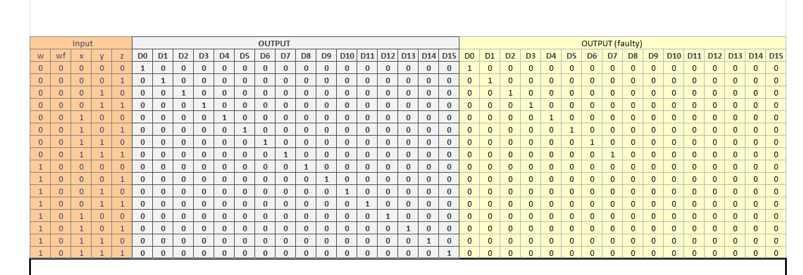
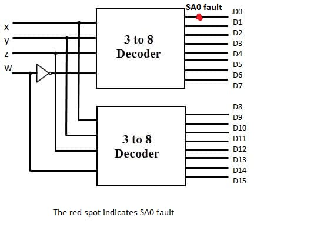

### Theory

### Stuck-at-Fault :

A Stuck-at fault (SAF) is a logic-level fault that mimics a manufacturing defect on a digital device, circuits, etc. A Stuck-at-Fault is of two types: stuck-at-0 (SA0) and stuck-at-1 (SA1) fault. Stuck at faults occur when a line is permanently stuck to Vcc or ground giving a faulty output. This line may be an input or output to any gate. Also this fault can be single or multiple stuck at faults, Although in this experiment we will only talk about single stuck at faults.  

 

Figure 2.1: Example of stuck-at-0 fault.
  

 

Figure 2.2: Example of stuck-at-1 fault.
  

A fault model is an engineering model of something that could go wrong in the construction or operation of a piece of equipment. From the model, the designer or user can then predict the consequences of this particular fault. To detect such fault, a suitable fault model is used. The user deliberately make Vcc or grounded positions and checks output. The user checks all types of faults that may occur in the circuit.

Basic fault models in digital circuits include the stuck-at fault model, the bridging fault model, the transistor faults, the open fault model, the delay fault model, etc. In the past several decades, the most popular fault model used in practice is the single stuck-at fault model. To use this fault model, each input pin on each gate in turn, is assumed to be grounded, and a test vector is developed to indicate the circuit is faulty. The test vector is a collection of bits to apply to the circuit's inputs, and a collection of bits expected at the circuit's output. If the gate pin under consideration is grounded, and this test vector is applied to the circuit, at least one of the output bits will not agree with the corresponding output bit in the test vector. The stuck-at fault model is a logical fault model because no delay information is associated with the fault definition. The single stuck-at fault model is structural because it is defined based on a structural gate-level circuit model.

### Decoder (binary decoder) :

In digital electronics, a binary decoder is a combinational logic circuit that converts binary information from the n coded inputs to a maximum of 2n unique outputs. The name "Decoder" means to translate or decode coded information from one format into another, so a binary decoder transforms "n" binary input signals into an equivalent code using 2n outputs. If a binary decoder receives n inputs (usually grouped as a single Binary or Boolean number) it activates one and only one of its 2n outputs based on that input with all other outputs deactivated. Decoders are also available with an additional "Enable" input pin which allows the decoded output to be turned "ON" or "OFF" by applying a logic "1" or logic "0" respectively to it. So for example, when the enable input is at logic level "0", (EN = 0) all outputs are "OFF" at logic "0" (for AND gates) regardless of the state of the inputs A and B.

The main difference between demultiplexer and decoder is that a demultiplexer is a combinational circuit that accepts only one input and directs it into one of the several outputs. On the contrary, the decoder is a combinational circuit that can accept many inputs and generate the decoded output.

Binary Decoders are most often used in more complex digital systems to access a particular memory location based on an "address" produced by a computing device. Commonly available decoder IC’s are the TTL 74LS138 3-to-8 line binary decoder or the 74ALS154 4-to-16 line decoder. They are also very useful for interfacing to 7-segment displays such as the TTL 74LS47.An example of a binary decoder is shown in figure 2.3 .

 

Figure 2.3: A 3x8 Binary decoder with enable pin.
  

### 3 to 8 decoder :

The number of available inputs are 3 and outputs are 8. Let us represent the inputs and outputs by symbol letters. Let us represent the inputs by S0, S1, and S2; and the outputs by D0, D1, D2, … D7. This decoder circuit gives 8 logic outputs for 3 inputs and has a enable pin. The circuit is designed with AND and NAND logic gates. It takes 3 binary inputs and activates one of the eight outputs. 3 to 8 line decoder circuit is also called a binary to an octal decoder. The block diagram of a simple 3x8 decoder is given below in figure 2.4:

 

Figure 2.4: The block diagram of a simple 3x8 decoder.
  

We can consider inputs as x, y, z and try to implement decoder using logic gates. The truth table of it is shown in figure 2.5 .

 

Figure 2.5: Truth Table of 3x8 decoder with x,y and z as input.
  

Using the truth table, we can write outputs D0 to D7 in terms of inputs x, y and z. Then it can be implemented into logic gates. The logic functions are shown in figure 2.6 .

 

Figure 2.6: The logic function for each output of 3x8 decoder.
  

Higher order decoders can be constructed from lower order ones. This is explained with an example below.

### 4-to-16 decoder using 3-to-8 decoder :

The parallel inputs x, y & z are applied to each 3 to 8 decoder. The complement of input, w is connected to Enable, E of upper 3 to 8 decoder in order to get the outputs, D0 to D7. These are the first eight minterms. The input, w is directly connected to Enable, E of lower 3 to 8 decoder in order to get the outputs, D8 to D15. These are the last eight minterms.

 

Figure 2.7: A 4x16 decoder made up of two 3x8 decoders.
  

when the w is at logic '0' the above decoder is turned on and gives output (D0 to D7), and when w is at logic '1' the below decoder is turned on and gives output (D8 to D15).The truth table of the 4 to 16 decoder is shown in figure 2.8 .

 

Figure 2.8: The truth table of 4x16 decoder.
  

### SA0 fault on x input wire :

Please note: SA0 faults on y and z wires will lead to similar cases, with some inputs always being low and other inputs as provided

#### Case (i) :

Consider the case of SA0 fault at the position shown in figure 2.9 .

 

Figure 2.9: The SA0 fault at x input line .
  

When this happens, the value of x is always changed to zero regardless of which decoder is activated. Therefore, the output lines that require x to be 1 will never be high, instead the output line corresponding to the same input with x = 0 will be high. For instance, if we give 1100 as the input, output line D12 should be high in case of normal operation. Since we have a SA0 fault, output line corresponding to 1000 (D8) will be high instead.

The expected as well as faulty values are listed in the table shown in figure 2.10 .

 

Figure 2.10: The Truth Table Comparing Output with fault and without fault. The xf represent faulty value of x.
  

#### Case (ii) :

Now consider the case of SA0 at a slightly different position:

 

Figure 2.11: The SA0 fault at x input line to the first 3x8 decoder.
  

Now, the effects of the fault are visible only when the first decoder is active. If an input activates the second decoder instead, the output is as expected. When the first decoder is active, the value of x will be changed to 0 regardless of the provided input. Once again, the output lines that require x to be 1 will not be high, instead the output line corresponding to the same input with x = 0 will be high. For example, if we provide 0101 as the input, the output line corresponding to 0001 (D1) will be high.

The truth table for this case is given in figure 2.12 .

 

Figure 2.12: The Truth Table Comparing Output with fault and without fault. Here xf represent faulty value of x input line to first decoder.
  

####  Case (iii) :

Finally consider SA0 fault at the position shown in figure 2.13 .

 

Figure 2.13: The SA0 fault at x input line to the second 3x8 decoder.
  

This case, in a sense, is the opposite of the previous case. If the input activates the first decoder, the output is as expected. The fault only affects the inputs activating the second decoder.

When the second decoder is active, the value of x will be changed to 0 because of the fault. The output lines that require x to be 1 will never be high, since x will be converted to 0. For example, if the input is 1111(D15), the output line for 1011(D11) will be high.

Truth table is given in figure 2.14 .

 

Figure 2.14: The Truth Table Comparing Output with fault and without fault. Here xf represent faulty value of x input line to second decoder.
  

### SA0 fault on w input wire:

#### Case (i) :

When SA0 fault is at the position shown in the figure 2.15 .

 

Figure 2.15: The SA0 fault at w input line.
  

In this case the value of 'w' will always be at logic '0' regardless of it's input values. Therefore, the above decoder(D0 to D7) will always be activated and the below decoder(D8 to D15) will always be deactivated. So, at the time when we expect output from below decoder (w input value is at logic high) we will see abnormalities in our circuit. We will see the repetition of the output pattern of above decoder. For instance, say the input is 0001 so the expected output and the output obtained both will be same i.e. D1,but if the input is 1001 so the expected output is D9 but the obtained output will be D1.

The truth table of faulty circuit with expected and obtained outputs is shown in figure 2.16 .

 

Figure 2.16: The Truth Table Comparing Output with fault and without fault. The wf represent faulty value of w.
  

Here w is the actual input value and wf (faulty value) represents the value of w changed due to fault present in the circuit.

#### Case (ii) : 

When SA0 fault is at the position as shown in figure 2.17 .

 

Figure 2.17: The SA0 fault at w input line to second 3x8 decoder.
  

In this case the SA0 fault in the circuit will be experienced only by the below decoder. For the above decoder the value of 'w' will be same as the input. But for the below decoder due to the SA0 fault present the value of 'w' will always be at logic '0' regardless of the input value of 'w'. As 'w' is an enable for below decoder so the below decoder will remain deactivated. So, at the time when we expect output from below decoder (w input value is at logic high) we get no output from the circuit, As at that time the above decoder is also deactivated. For instance, say the input is 0010 so the output obtained both will be same as expected output i.e. D2,but if the input is 1001 so the expected output is D9 but no output will be obtained in this case, as both of the decoders are deactivated.

The truth table of this faulty circuit with expected and obtained outputs is shown in figure 2.18.

 

Figure 2.18: The Truth Table Comparing Output with fault and without fault. Here wf represent faulty logic signal received by second 3x8 decoder.
  

Here w is the actual input value and wf (faulty value) represents the changed value of w connected only to decoder 2

#### Case (iii) :

When SA0 fault is on the w line at the position shown in figure 2.19 .

 

Figure 2.19: The SA0 fault at w input line (before NOT gate) to first 3x8 decoder.
  

In this case, SA0 fault is present at the position wf and hence '0' is passed to NOT gate irrespective of input w. So decoder 1 is enabled for all inputs w. In case of w being 0, only decoder 1 is enabled. In case of 'w' being '1', both decoder 1 and decoder 2 are activated, so one output D0 to D7 is 1 and another output D8 to D15 is also high. Thus, in this case when we are expecting decoder 1 to be inactive, SA0 fault is passed through NOT gate and decoder 1 is enabled for all input values 'w'.

For example, say input wxyz is 0010, then output obtained is same as expected output i.e. D2. But if the input is 1010, the expected output is D10, but faulty output is both D2 and D10 are high, as both decoders are activated. The truth table for expected and faulty output values is given in figure 2.20 .

 

Figure 2.20: The Truth Table Comparing Output with fault and without fault. Here wf represent faulty logic signal received by first 3x8 decoder.
  

#### Case (iv) :

When SA0 fault is on the w input line at the position shown in the figure 2.21

 

Figure 2.21: The SA0 fault at w input line (after NOT gate) to first 3x8 decoder.
  

In this case, the SA0 fault is experienced only by decoder 1. For decoder 2, the value of 'w' is same as the input value. But decoder 1 will stay deactivated for all input values 'w' due to the presence of stuck-at-0 fault on the wire connecting to its enable switch. So when 'w' is high, decoder 2 gets activated and output values are the same as expected outputs. But in case of 'w' held low ('0'), we expect decoder 1 to be enabled, but due to SA0 decoder 1 remains deactivated and we get no output.

For example, if input wxyz is 1011, then output is the same as expected output, i.e. D11. But when input is 0011, we expect output D3 but no output is obtained. The truth table for expected and faulty output values is given below:

 

Figure 2.22: The Truth Table Comparing Output with fault and without fault. Here wf represent faulty logic signal received by first 3x8 decoder.
  

### SA0 fault on output line :

Please note: SA0 faults on other output lines will lead to similar cases, with some outputs always being low (stuck-at-0) and others as expected

### SA0 fault on D0 output line :

 

Consider the fault on line D0 as shown in figure 2.23.
  

In this case, irrespective of the input, D0 is always low. If input is 0000, then output D0 is expected to be 1. But due to stuck-at-0 on line D0, output D0 is also low and hence no output is obtained. For all other inputs, the output obtained is the same as expected output.

The truth table for this case is given in figure 2.24 .
 

 

Figure 2.24:The Truth Table Comparing Output with fault and without fault. Here fault is at D0 output line.
  
