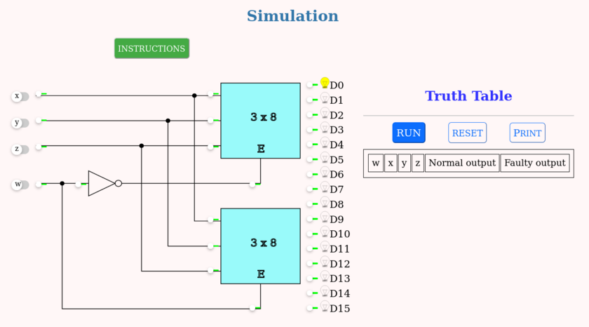

### PROCEDURE

 
1. The circuit simulated is as shown in the below image.

2. Click the input switches to select the required inputs named "x", "y", "z" and "w". Switch in the "ON" state is and "OFF" state is .

3. The simulation will display corresponding output. Output is displayed as a glowing bulb.

4. Press the "RUN" button to display the output in the truth table. Verify the input values and corresponding output values from the truth table.

5. "RESET" button clears all entries of truth table and resets the simulator.

6. At specific positions, small switches make the lines stuck-at-0. Clicking them simulates SA0 faults at the said locations. Line is stuck-at-0 if . The line is normal if switch is green .

7. Repeat above steps for all possible inputs and verify the truth table.

<!-- <a href="/simulation/sim.html">Link</a> for simulation. -->

The simulation should be displayed as shown:

Figure: A simulation instance

